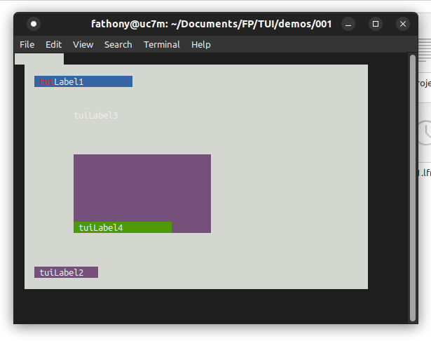

# TUI
`Lazarus component for Text User Interface (console) + designer`

It provides easy and visual toolkit for devoloping console application
(similar to TurboVision / FreeVision framework) with `class` inheritance,
while TV/FV using `object` basis.

Author:
  - x2nie (2015 TComponent basis)
  - FPC team & contributor (1998 ~ 2000)
  

To run (ver 0.1):
  * mix or copy the source code from C:\FPC\2.6.4\source\packages\fv\src
  * Using Lazarus, open the sample100.pas 
  * Run (F9)
  
Todo:
* Create runtime package
* Crate design-time package that provides:
  * Form Designer that able using Lazarus's Object Inspector
  * wizard for `New Tui Application`

